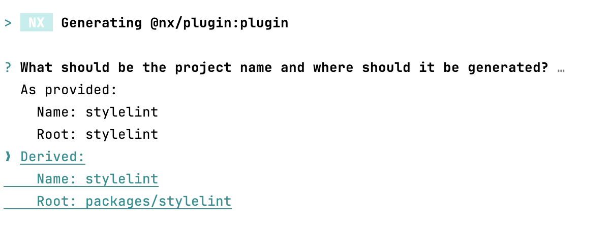

# Exercise: Custom Plugin

Learn how to create a custom executor with Nx for enhancing your project setup. This guide covers generating a plugin, adopting a custom configuration, and executing the executor to streamline development processes.

This document guides you through creating a custom Nx executor to run Stylelint configuration in your project, ensuring consistent style conventions.

## 1. Generate Plugin

Start by generating a plugin with the nx generate @nx/plugin:generator command. This step initializes the necessary setup for your custom generator.

1. Install `npm i @nx/plugin -D`
2. Run `nx generate @nx/plugin:plugin stylelint`

